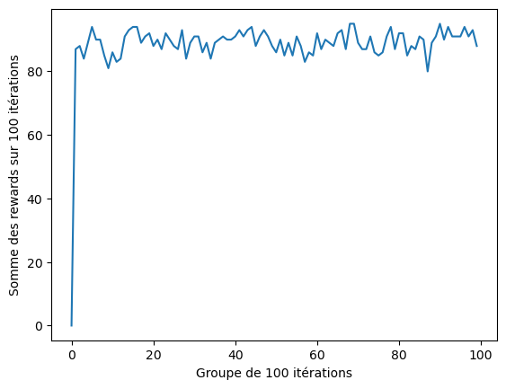

## Réponses qux questions

> Identify and copy the python code that performs the value function adaptation 
> (i.e., the modification of Q-values). Is is the same as the one presented in the 
> lesson ? does it correspond to SARSA or Q-learning ? what is the difference 
> between those learning algorithms ? Explain.

```
new_value = ((1 - alpha) * old_value) + (alpha * (reward + gamma * next_max))
q_table[state, action] = new_value
```

C'est la formule d'adaptation de l'algorithme Q-Learning. La différence entre les algorithmes SARSA et Q-Learning se situe au niveau de la prochaine Q-value qui est prise. SARSA va choisir la Q-Value la plus probable étant donné sa politique alors que Q-Learning va prendre la Q-Value maximale du prochain état.

> Using a 4x4 environment modify the code to stop the learning process every 100
> epochs to evaluate the performance of the agent. To do this, you can run 100
> episodes (Each time the agent is placed in a starting position and tries to reach
> the target. Take note of how many times it reaches the target) while putting
> alpha to zero (no learning) and epsilon to zero (no exploration). Generate a plot
> of the evolution of the performance as a function of interations.



TODO next question


